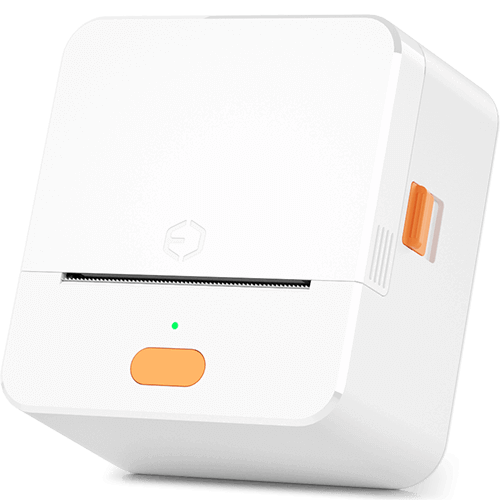

# LPAPI Thermal Printer Plugin

A Flutter plugin for Dothantech thermal label printers that provides seamless Bluetooth connectivity and printing capabilities. This plugin supports direct printer discovery without requiring manual Bluetooth pairing, making it ideal for warehouse and retail applications.

## Features

- 🔍 **Bluetooth Discovery**: Find printers without manual pairing
- 🔗 **Direct Connection**: Connect to printers instantly
- 📝 **Text Printing**: Print plain text with customizable formatting
- 📊 **Barcode Support**: Generate and print 1D barcodes
- 📱 **QR Codes**: Create and print 2D QR codes
- 🖼️ **Image Printing**: Print images from base64 data
- ⚙️ **Print Settings**: Adjustable density and speed
- 📱 **Android Support**: Full support for Android devices
- 🍎 **iOS Support**: Full support for iOS devices

## Supported Printers

This plugin works with Dothantech thermal label printers using the LPAPI SDK, including:

- Bluetooth thermal label printers
- Mobile receipt printers
- Portable label printers

### Tested Devices

This plugin has been tested and verified to work with:

- **P1 Series Label Printer** - Full functionality confirmed including Bluetooth discovery, connection, and all printing features



#### P1 Series Printer Features

- **Bluetooth Connectivity**: Seamless wireless connection without manual pairing
- **Label Sizes**: Supports various label dimensions (tested with 48mm x 50mm labels)
- **Print Quality**: Adjustable density (0-20) and speed (1-5) settings
- **Barcode Support**: 1D barcodes with optional text labels
- **QR Code Support**: 2D QR codes for product tracking and information
- **Image Printing**: Base64 encoded image support for logos and graphics

## Installation

Add this to your package's `pubspec.yaml` file:

```yaml
dependencies:
  flutter_dothantech_lpapi_thermal_printer: ^1.0.0
```

Then run:

```bash
flutter pub get
```

## Platform Setup

### Android

#### Permissions

Add the following permissions to your `android/app/src/main/AndroidManifest.xml`:

```xml
<uses-permission android:name="android.permission.BLUETOOTH" />
<uses-permission android:name="android.permission.BLUETOOTH_ADMIN" />
<uses-permission android:name="android.permission.BLUETOOTH_SCAN" />
<uses-permission android:name="android.permission.BLUETOOTH_CONNECT" />
<uses-permission android:name="android.permission.ACCESS_FINE_LOCATION" />
<uses-permission android:name="android.permission.ACCESS_COARSE_LOCATION" />
```

#### MinSDK Version

Ensure your `android/app/build.gradle` has:

```gradle
android {
    compileSdkVersion 33

    defaultConfig {
        minSdkVersion 21
        targetSdkVersion 33
    }
}
```

### iOS

#### Permissions

Add the following to your `ios/Runner/Info.plist`:

```xml
<key>NSBluetoothAlwaysUsageDescription</key>
<string>This app needs Bluetooth access to connect to thermal printers</string>
<key>NSBluetoothPeripheralUsageDescription</key>
<string>This app needs Bluetooth access to connect to thermal printers</string>
```

#### Deployment Target

Ensure your iOS deployment target is at least 12.0. Update `ios/Podfile`:

```ruby
platform :ios, '12.0'
```

## Usage

### Import the package

```dart
import 'package:flutter_dothantech_lpapi_thermal_printer/flutter_dothantech_lpapi_thermal_printer.dart';
```

### Initialize the printer

```dart
final printer = LpapiThermalPrinter();
```

### Request Permissions

#### Android

For Android 12+ (API 31+), you need to request Bluetooth permissions at runtime:

```dart
import 'package:permission_handler/permission_handler.dart';

Future<void> requestPermissions() async {
  if (Platform.isAndroid) {
    Map<Permission, PermissionStatus> statuses = await [
      Permission.bluetooth,
      Permission.bluetoothScan,
      Permission.bluetoothConnect,
      Permission.location,
    ].request();

    if (!statuses.values.every((status) => status.isGranted)) {
      print('Please grant all permissions to use the printer');
    }
  } else if (Platform.isIOS) {
    // iOS will automatically request Bluetooth permissions when scanning
    // No additional runtime permissions needed if Info.plist is configured
  }
}
```

### Discover Printers

#### Find all nearby printers (including unpaired):

```dart
List<PrinterInfo> printers = await printer.discoverPrinters();
for (var p in printers) {
  print('Found printer: ${p.name} at ${p.address}');
}
```

#### Find only paired printers:

```dart
List<PrinterInfo> pairedPrinters = await printer.searchPrinters();
```

### Connect to a Printer

#### Connect to a specific printer:

```dart
bool connected = await printer.connectPrinter('00:11:22:33:44:55');
if (connected) {
  print('Connected successfully!');
}
```

#### Quick connect to first available printer:

```dart
bool connected = await printer.connectFirstPrinter();
```

### Check Connection Status

```dart
String status = await printer.getPrinterStatus();
print('Printer status: $status'); // 'connected', 'disconnected', 'connecting'
```

### Print Operations

#### Print Text

```dart
await printer.printText(
  'Hello World!',
  width: 48,  // Label width in mm
  height: 50, // Label height in mm
);
```

#### Print 1D Barcode

```dart
await printer.print1DBarcode(
  '1234567890',           // Barcode data
  text: 'Product Label',  // Optional text above barcode
  width: 48,
  height: 50,
);
```

#### Print QR Code

```dart
await printer.print2DBarcode(
  'https://example.com', // QR code data
  width: 48,
  height: 50,
);
```

#### Print Image

```dart
// Convert image to base64
String base64Image = base64Encode(imageBytes);
await printer.printImage(base64Image);
```

### Adjust Print Settings

#### Set Print Density (Darkness)

```dart
await printer.setPrintDensity(10); // 0 (lightest) to 20 (darkest)
```

#### Set Print Speed

```dart
await printer.setPrintSpeed(3); // 1 (slowest) to 5 (fastest)
```

### Disconnect

```dart
await printer.disconnectPrinter();
```

## Complete Example

```dart
import 'package:flutter/material.dart';
import 'package:flutter_dothantech_lpapi_thermal_printer/flutter_dothantech_lpapi_thermal_printer.dart';
import 'package:permission_handler/permission_handler.dart';

class PrinterExample extends StatefulWidget {
  @override
  _PrinterExampleState createState() => _PrinterExampleState();
}

class _PrinterExampleState extends State<PrinterExample> {
  final printer = LpapiThermalPrinter();
  List<PrinterInfo> printers = [];
  String status = 'Disconnected';

  @override
  void initState() {
    super.initState();
    checkStatus();
  }

  Future<void> checkStatus() async {
    String s = await printer.getPrinterStatus();
    setState(() {
      status = s;
    });
  }

  Future<void> discoverPrinters() async {
    // Request permissions first
    await [
      Permission.bluetooth,
      Permission.bluetoothScan,
      Permission.bluetoothConnect,
      Permission.location,
    ].request();

    // Discover printers
    List<PrinterInfo> found = await printer.discoverPrinters();
    setState(() {
      printers = found;
    });
  }

  Future<void> connectAndPrint(String address) async {
    // Connect
    bool connected = await printer.connectPrinter(address);
    if (!connected) {
      print('Failed to connect');
      return;
    }

    // Set print settings
    await printer.setPrintDensity(8);
    await printer.setPrintSpeed(3);

    // Print text
    await printer.printText('Hello from Flutter!');

    // Print barcode
    await printer.print1DBarcode(
      '1234567890',
      text: 'Product SKU',
    );

    // Print QR code
    await printer.print2DBarcode('https://example.com');

    // Disconnect
    await printer.disconnectPrinter();
  }

  @override
  Widget build(BuildContext context) {
    return Scaffold(
      appBar: AppBar(title: Text('Printer Example')),
      body: Column(
        children: [
          Text('Status: $status'),
          ElevatedButton(
            onPressed: discoverPrinters,
            child: Text('Discover Printers'),
          ),
          Expanded(
            child: ListView.builder(
              itemCount: printers.length,
              itemBuilder: (context, index) {
                final p = printers[index];
                return ListTile(
                  title: Text(p.name),
                  subtitle: Text(p.address),
                  onTap: () => connectAndPrint(p.address),
                );
              },
            ),
          ),
        ],
      ),
    );
  }
}
```

## API Reference

### PrinterInfo Class

```dart
class PrinterInfo {
  final String name;    // Printer name
  final String address; // MAC address
  final String type;    // 'PAIRED' or 'DISCOVERED'
}
```

### LpapiThermalPrinter Methods

| Method                                                                 | Description                        | Returns                     |
| ---------------------------------------------------------------------- | ---------------------------------- | --------------------------- |
| `searchPrinters()`                                                     | Find paired printers               | `Future<List<PrinterInfo>>` |
| `discoverPrinters()`                                                   | Discover all nearby printers       | `Future<List<PrinterInfo>>` |
| `connectPrinter(String address)`                                       | Connect to specific printer        | `Future<bool>`              |
| `connectFirstPrinter()`                                                | Connect to first available printer | `Future<bool>`              |
| `disconnectPrinter()`                                                  | Disconnect from printer            | `Future<bool>`              |
| `getPrinterStatus()`                                                   | Get connection status              | `Future<String>`            |
| `printText(String text, {int width, int height})`                      | Print plain text                   | `Future<bool>`              |
| `print1DBarcode(String barcode, {String text, int width, int height})` | Print 1D barcode                   | `Future<bool>`              |
| `print2DBarcode(String barcode, {int width, int height})`              | Print QR code                      | `Future<bool>`              |
| `printImage(String base64Image)`                                       | Print image                        | `Future<bool>`              |
| `setPrintDensity(int density)`                                         | Set print darkness (0-20)          | `Future<bool>`              |
| `setPrintSpeed(int speed)`                                             | Set print speed (1-5)              | `Future<bool>`              |

## Troubleshooting

> **Note**: This plugin has been thoroughly tested with the P1 Series Label Printer. If you're using a different Dothantech printer model, the functionality should be similar, but some features may vary.

### Printer not found during discovery

1. Ensure Bluetooth is enabled on your device
2. Check that all required permissions are granted
3. Make sure the printer is powered on and in range
4. Try both `searchPrinters()` (for paired) and `discoverPrinters()` (for all)

### Connection fails

1. Verify the printer MAC address is correct
2. Ensure no other device is connected to the printer
3. Try disconnecting and reconnecting
4. Power cycle the printer if necessary

### Print quality issues

- Adjust print density: Higher values (15-20) for darker prints
- Adjust print speed: Lower values (1-2) for better quality
- Ensure the label size parameters match your actual labels

### Android 12+ Permission Issues

For Android 12 and above, location permission is required for Bluetooth scanning. Make sure to:

1. Request permissions at runtime
2. Enable location services on the device
3. Add all required permissions to AndroidManifest.xml

### iOS Bluetooth Issues

For iOS devices:

1. Ensure Bluetooth permissions are added to Info.plist
2. Make sure the device's Bluetooth is turned on
3. The printer must be in pairing/discoverable mode
4. iOS may cache Bluetooth connections - try restarting the app if connection fails

## Contributing

Contributions are welcome! Please feel free to submit a Pull Request.

### Development Setup

1. Clone the repository
2. Run `flutter pub get` in both root and example directories
3. Connect an Android device or emulator
4. Run the example app: `cd example && flutter run`

## License

This project is licensed under the MIT License - see the LICENSE file for details.

## Credits

This plugin uses the Dothantech LPAPI SDK for printer communication.

## Support

For issues, questions, or contributions, please visit the [GitHub repository](https://github.com/yourusername/lpapi_thermal_printer).
